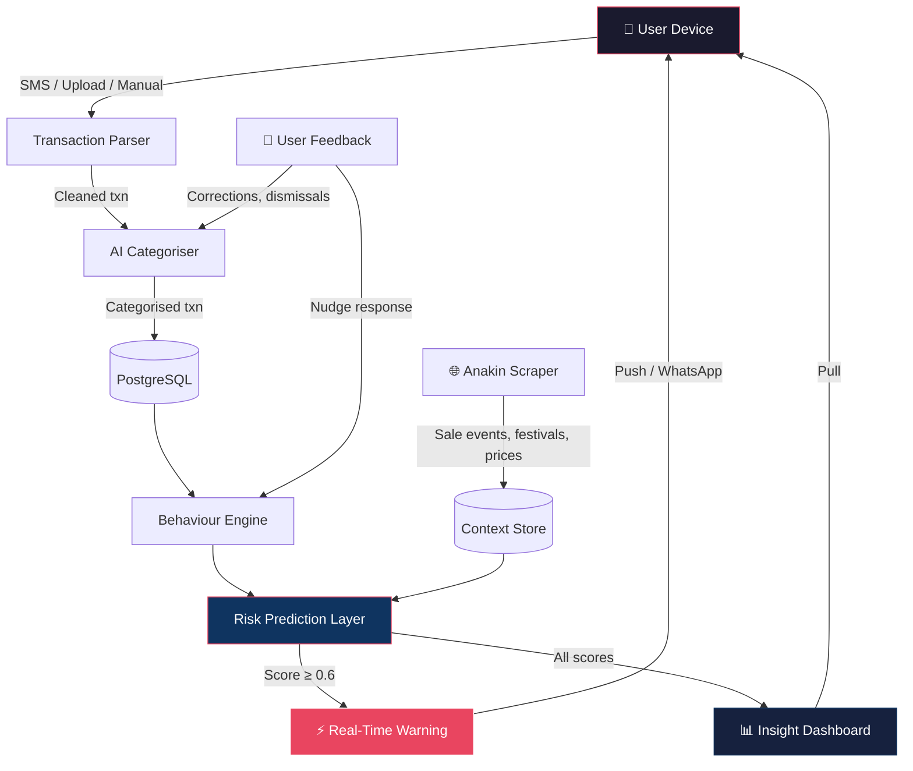

# DigiKhata — System Architecture

## Pipeline Overview

```
┌─────────────────────────────────────────────────────────────────────┐
│                        DATA INGESTION                              │
│  ┌──────────┐    ┌──────────────────┐    ┌─────────────────────┐   │
│  │ UPI SMS  │    │ Bank Statement   │    │  Manual Entry       │   │
│  │ Listener │    │ Upload (PDF/CSV) │    │  (Quick-add UI)     │   │
│  └────┬─────┘    └────────┬─────────┘    └──────────┬──────────┘   │
│       └──────────────┬────┴─────────────────────────┘              │
│                      ▼                                             │
│              ┌───────────────┐                                     │
│              │ TRANSACTION   │  Normalize → Dedupe → Extract       │
│              │ PARSER        │  merchant, amount, date, mode       │
│              └───────┬───────┘                                     │
└──────────────────────┼─────────────────────────────────────────────┘
                       ▼
┌──────────────────────────────────────────────────────────────────────┐
│                     INTELLIGENCE LAYER                               │
│                                                                      │
│  ┌────────────────────┐    ┌─────────────────────────────────────┐   │
│  │ AI CATEGORISER     │    │ BEHAVIOUR ENGINE                    │   │
│  │                    │    │                                     │   │
│  │ • Merchant → Cat   │───▶│ • Temporal pattern detection        │   │
│  │ • Fuzzy matching   │    │ • Recurring vs. impulse classifier  │   │
│  │ • User corrections │    │ • Day-of-week / time-of-day heatmap │   │
│  │   retrain loop     │    │ • Category velocity anomalies       │   │
│  └────────────────────┘    └──────────────┬──────────────────────┘   │
│                                           │                          │
│  ┌────────────────────┐                   │                          │
│  │ ANAKIN             │                   │                          │
│  │ (Context Scraper)  │                   │                          │
│  │                    │                   │                          │
│  │ • Sale/offer events│───────────────────┤                          │
│  │ • Payday cycles    │                   │                          │
│  │ • Festival spend   │                   │                          │
│  │   patterns         │                   │                          │
│  │ • Peer benchmarks  │                   │                          │
│  └────────────────────┘                   │                          │
│                                           ▼                          │
│                            ┌──────────────────────────┐              │
│                            │ RISK PREDICTION LAYER    │              │
│                            │                          │              │
│                            │ P(overspend) scoring     │              │
│                            │ per user × category ×    │              │
│                            │ time window              │              │
│                            └────────────┬─────────────┘              │
└─────────────────────────────────────────┼────────────────────────────┘
                                          ▼
┌──────────────────────────────────────────────────────────────────────┐
│                      ACTION LAYER                                    │
│                                                                      │
│  ┌────────────────────────────┐    ┌──────────────────────────────┐  │
│  │ REAL-TIME SPENDING WARNING │    │ INSIGHT DASHBOARD            │  │
│  │                            │    │                              │  │
│  │ • Push notification nudge  │    │ • Weekly pulse summary       │  │
│  │ • In-app interstitial      │    │ • Streak tracker             │  │
│  │ • WhatsApp message         │    │ • Category burn-rate bars    │  │
│  │ • Contextual alternatives  │    │ • Peer comparison widget     │  │
│  │   ("Cook instead? Save ₹X")│    │ • Month-over-month trend    │  │
│  └────────────────────────────┘    └──────────────────────────────┘  │
└──────────────────────────────────────────────────────────────────────┘
```

---

## Layer-by-Layer Specification

### 1. Data Ingestion

| Source | Method | Priority |
|---|---|---|
| **UPI SMS** | Android SMS permission → regex parser for Google Pay, PhonePe, Paytm, bank UPI formats | P0 — covers 80%+ of transactions |
| **Bank Statement** | PDF/CSV upload → tabular extraction (Camelot / pdfplumber) | P1 — backfill + validation |
| **Manual Entry** | Quick-add UI: amount + category, 2-tap flow | P2 — edge cases, cash spend |

**Key constraint:** No bank API integration in v1. SMS-first keeps onboarding friction at zero (one permission grant, no linking).

---

### 2. Transaction Parser

**Input:** Raw SMS string / CSV row / manual entry  
**Output:** Structured transaction object

```json
{
  "id": "txn_a8f3k2",
  "amount": 347,
  "merchant": "Zomato",
  "merchant_normalised": "zomato",
  "category": "food_delivery",
  "timestamp": "2026-05-10T02:14:00+05:30",
  "mode": "upi",
  "source": "sms",
  "is_recurring": false,
  "confidence": 0.94
}
```

**Parser pipeline:**
1. **Regex extraction** — amount, account, reference number from SMS templates
2. **Merchant normalisation** — "ZOMATO ORDER" / "ZMT*ORDER" / "ZOMATO" → `zomato`
3. **Deduplication** — match on (amount ± ₹1, merchant, timestamp ± 5min) to avoid double-counting SMS + statement
4. **Enrichment** — attach merchant metadata (category hint, logo, location if available)

---

### 3. AI Categoriser

**Problem:** Merchant names in SMS are messy. "IRCTC" is travel. "DMart" is groceries. "AMZN*2K4JF8" could be anything.

**Approach:**

| Layer | Method | Accuracy |
|---|---|---|
| **Lookup table** | Top 500 merchants → hardcoded category | ~70% of transactions |
| **Fuzzy match** | Levenshtein + token overlap against known merchants | +15% |
| **ML classifier** | Fine-tuned text classifier on (merchant_string, amount, time) → category | +10% |
| **User correction** | "Was this food? [Yes / No, it was ___]" → retrain | +5%, personalisation |

**Categories (v1):**

| Category | Examples |
|---|---|
| `food_delivery` | Zomato, Swiggy |
| `food_dineout` | Restaurants, cafes |
| `groceries` | DMart, BigBasket, Zepto |
| `transport` | Uber, Ola, Metro, IRCTC |
| `entertainment` | Netflix, BookMyShow, gaming |
| `shopping` | Amazon, Flipkart, Myntra |
| `rent_bills` | Rent, electricity, WiFi |
| `health` | Pharmacy, gym, doctor |
| `education` | Courses, books |
| `transfers` | Peer-to-peer UPI (excluded from spend by default) |
| `uncategorised` | Confidence < 0.6 → prompt user |

---

### 4. Behaviour Engine

This is the core IP. Not just *what* users spend on — but *when, why, and under what conditions* they overspend.

**Pattern detectors:**

| Pattern | Signal | Example |
|---|---|---|
| **Temporal clustering** | Day-of-week × time-of-day heatmap | "You spend 3× more on food delivery between Fri 10PM–Sat 2AM" |
| **Payday surge** | Spend velocity in first 5 days post-salary vs. rest of month | "You burn 40% of discretionary budget in the first week" |
| **Category velocity** | Rate of spend in a category vs. trailing 4-week average | "Shopping spend is 2.1× your normal by Day 12" |
| **Impulse classifier** | Transaction characteristics: late night + food delivery + small-medium amount + high frequency | Binary flag: `is_impulse: true` |
| **Streak tracker** | Consecutive days under personal daily target | "🔥 7-day streak — you haven't impulse-ordered in a week" |

**Output:** Per-user behavioural profile updated daily.

```json
{
  "user_id": "u_29fk3",
  "risk_windows": [
    { "day": "friday", "time": "22:00-02:00", "category": "food_delivery", "avg_impulse": 412 },
    { "day": "saturday", "time": "14:00-18:00", "category": "shopping", "avg_impulse": 1800 }
  ],
  "payday_surge_factor": 2.3,
  "current_streak": 7,
  "impulse_ratio_30d": 0.31
}
```

---

### 5. Anakin (External Context Scraper)

Named after the one who was supposed to bring balance. Scrapes external signals that *amplify* or *explain* spending patterns.

| Signal | Source | Use |
|---|---|---|
| **Sale events** | Scrape Amazon/Flipkart/Myntra sale pages, Twitter trends | Pre-emptive warning: "Amazon sale starts tomorrow. Last sale, you spent ₹4,200 unplanned." |
| **Festival calendar** | Indian festival API / static calendar | Contextualise spend spikes — Diwali ≠ impulse |
| **Payday detection** | Infer from salary credit SMS pattern | Trigger payday surge warnings |
| **Peer benchmarks** | Aggregated anonymised cohort data | "People your age in Bangalore spend ₹2,800/mo on food delivery. You: ₹4,100." |
| **Inflation / price signals** | Commodity / food price indices (public APIs) | "Grocery prices up 8% this month — your grocery spend increase is partly inflation, not overspending." |

**Ethics guardrail:** All peer data is anonymised, aggregated (min cohort size = 50), and never sold at individual level.

---

### 6. Risk Prediction Layer

**Input:** Behaviour profile + external context + current state  
**Output:** `P(overspend)` score per user, per category, per time window

**Model (v1 — simple, interpretable):**

```
P(overspend | user, category, time_window) =
    w1 × temporal_risk_score +
    w2 × days_since_payday_factor +
    w3 × category_velocity_ratio +
    w4 × external_trigger_flag +
    w5 × streak_momentum (negative correlation)
```

**Scoring tiers:**

| Score | Label | Action |
|---|---|---|
| 0.0 – 0.3 | 🟢 Low | No intervention |
| 0.3 – 0.6 | 🟡 Medium | Passive nudge (dashboard highlight) |
| 0.6 – 0.8 | 🟠 High | Active nudge (push notification) |
| 0.8 – 1.0 | 🔴 Critical | Urgent nudge + alternative suggestion |

**Key design choice:** Start with a weighted linear model, not deep learning. Interpretability matters — users need to understand *why* they got a warning, or they'll ignore it.

---

### 7. Real-Time Spending Warning

The **30-second intervention** — the reason this product exists.

**Delivery channels (priority order):**

| Channel | When | Example |
|---|---|---|
| **Push notification** | Risk score ≥ 0.6 and user enters high-risk time window | "⚠️ Friday night food delivery zone. You've spent ₹1,200 on Swiggy this week already. Cook instead? Save ₹350." |
| **WhatsApp message** | Weekly pulse + critical alerts (if push disabled) | "Your week: ₹2,100 on food delivery (↑38%). One action: skip tonight's order." |
| **In-app interstitial** | User opens app during high-risk window | Full-screen card with streak status + risk context |

**Nudge design principles:**
- **Specific, not preachy:** "₹347 on Swiggy tonight would put you ₹800 over your food budget" — not "Be careful with spending!"
- **Offer alternatives:** "Cook dal chawal? Save ₹300" / "Pack lunch tomorrow? Save ₹150"
- **Time-bounded:** "This warning expires in 2 hours" — creates urgency without nagging
- **Celebrate wins:** "You ignored last Friday's Swiggy urge. Saved ₹450. Streak: 🔥8 days"

---

### 8. Insight Dashboard

The *pull* layer — users come here when they *want* to understand. Not the primary intervention surface.

**Components:**

| Widget | What it shows |
|---|---|
| **Weekly Pulse Card** | One number: "You spent ₹X this week." One action: "Do Y to stay on track." |
| **Category Burn Rate** | Health-bar style progress per category. Green → Yellow → Red as budget depletes. |
| **Streak Tracker** | Current streak length + personal best + peer percentile |
| **Spend Heatmap** | 7×24 grid: day × hour, coloured by spend intensity. Users see their danger zones. |
| **Monthly Trend** | Simple line chart: this month vs. last 3 months |
| **Peer Benchmark** | "You vs. earners your age in your city" — single horizontal bar |
| **Anakin Alerts** | Upcoming sale events / festivals with historical spend context |

---

## Tech Stack (Planned)

| Layer | Technology | Rationale |
|---|---|---|
| **Mobile app** | React Native (Expo) | Cross-platform, fast iteration, existing team skill |
| **Backend API** | Node.js + Express | JS ecosystem consistency, async-friendly |
| **Database** | PostgreSQL + Redis | Structured transactions (PG) + real-time caching (Redis) |
| **ML pipeline** | Python (scikit-learn → FastAPI microservice) | Model training + serving, isolated from main API |
| **Nudge delivery** | Firebase Cloud Messaging + WhatsApp Business API | Push + WhatsApp coverage |
| **Scraper (Anakin)** | Python (BeautifulSoup / Playwright) + cron | Scheduled scrapes, isolated worker |
| **Hosting** | AWS (EC2 + RDS + S3) or Railway (v1) | Railway for speed, migrate to AWS at scale |
| **Monitoring** | Sentry + PostHog | Error tracking + product analytics |

---

## Data Flow Diagram



---

## Security & Privacy

| Concern | Mitigation |
|---|---|
| SMS data sensitivity | All SMS parsed on-device in v1; only structured txn objects sent to server |
| Financial data storage | AES-256 encryption at rest, TLS 1.3 in transit |
| Peer benchmarks | Min cohort size = 50, k-anonymity, no individual data exposed |
| B2B data licensing | Only aggregated, anonymised behavioural cohorts — never individual profiles |
| User deletion | Full GDPR-style data deletion within 48 hours on request |
